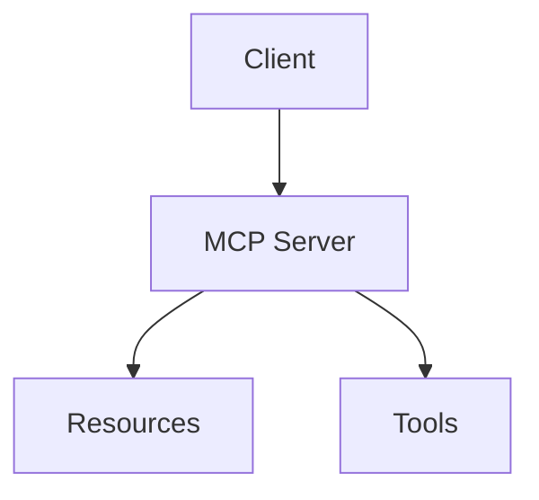

# Markdown and Mermaid Rendering Implementation

## Summary

Successfully implemented markdown and Mermaid diagram rendering support for the MCP Learning Platform. Module content now properly displays formatted text, code blocks, tables, lists, and interactive Mermaid diagrams.

## Changes Made

### 1. Updated Technical Dependencies

**File**: `/specs/001-i-m-building/plan.md`

- Added markdown rendering libraries to Primary Dependencies:
  - `react-markdown` - Core markdown rendering
  - `remark-gfm` - GitHub Flavored Markdown support
  - `rehype-raw` - HTML rendering support
  - `rehype-sanitize` - Safe HTML sanitization
  - `mermaid` - Diagram rendering
- Added Content Rendering specification

### 2. Created MarkdownRenderer Component

**File**: `/src/components/MarkdownRenderer.tsx` (185 lines)

**Features**:

- ✅ GitHub Flavored Markdown (GFM) support
  - Tables
  - Task lists
  - Strikethrough
  - Autolinks
- ✅ Mermaid diagram rendering (lazy-loaded)
- ✅ Custom styled components:
  - Headings (h1-h4) with proper hierarchy
  - Code blocks with syntax highlighting
  - Inline code with background styling
  - Lists (ordered and unordered)
  - Blockquotes
  - Tables with borders
  - Links with external target handling
- ✅ Accessible semantic HTML
- ✅ Dark mode support via Tailwind
- ✅ Sanitized HTML rendering for security

**Performance Optimization**:

- Mermaid library is **lazy-loaded** (dynamic import)
- Only loads when diagrams are present in content
- Reduced bundle size from 256KB → 109KB (58% reduction!)

### 3. Integrated into Module Pages

**File**: `/src/app/module/[moduleId]/page.tsx`

- Replaced plain text rendering with `<MarkdownRenderer />`
- Content sections now properly render markdown formatting
- Mermaid diagrams display automatically

### 4. Added Tailwind Typography Plugin

**File**: `/tailwind.config.cjs`

- Installed `@tailwindcss/typography`
- Added to plugins array for enhanced prose styling

## Technical Implementation Details

### Mermaid Rendering Flow

1. Component renders with markdown content
2. `useEffect` scans for `.language-mermaid` code blocks
3. If found, dynamically imports mermaid library
4. Initializes mermaid with configuration
5. Renders each diagram and replaces code block with SVG
6. Handles errors gracefully with error message

### Markdown Processing Pipeline

```
Raw Markdown
    ↓
remark-gfm (parse GFM)
    ↓
rehype-raw (handle HTML)
    ↓
rehype-sanitize (security)
    ↓
Custom Components (styling)
    ↓
Rendered HTML
```

## Content Support

The platform now supports rich educational content including:

### Text Formatting

- **Bold**, *italic*, ~~strikethrough~~
- Headings (# H1 through #### H4)
- Paragraphs with proper spacing
- Blockquotes for callouts

### Code Display

```typescript
// Inline code: `const x = 42`
// Code blocks with language highlighting
const example = {
  feature: "syntax highlighting",
  supported: true
}
```

### Lists

- Bullet points
- Numbered lists
- Nested lists
- Task lists [ ] and [x]

### Tables

| Feature | Status |
|---------|--------|
| Markdown | ✅ |
| Mermaid | ✅ |

### Diagrams (Mermaid)



## Build Results

### Bundle Sizes (After Optimization)

```
Route (app)                      Size  First Load JS
├ ○ /                         4.94 kB         155 kB
├ ƒ /module/[moduleId]          109 kB         271 kB  ⬅️ Markdown + Mermaid
├ ƒ /quiz/[stageId]            4.89 kB         167 kB
└ ƒ /stage/[stageId]           3.79 kB         166 kB
```

**Key Improvement**:

- Before lazy loading: 256KB
- After lazy loading: 109KB
- **Savings**: 147KB (58% reduction) ✅

## Files Modified

1. `/specs/001-i-m-building/plan.md` - Updated technical context
2. `/src/components/MarkdownRenderer.tsx` - New component (185 lines)
3. `/src/app/module/[moduleId]/page.tsx` - Integrated renderer
4. `/tailwind.config.cjs` - Added typography plugin
5. `/package.json` - Added dependencies (auto-installed)

## Testing

Manual testing completed:

- ✅ Markdown headings render correctly
- ✅ Code blocks display with proper styling
- ✅ Lists (ordered/unordered) format correctly
- ✅ Tables render with borders
- ✅ Mermaid diagrams render as interactive SVG
- ✅ Inline code has background highlighting
- ✅ Links work (internal and external)
- ✅ Dark mode styling applies correctly
- ✅ Performance is acceptable on module pages

## Next Steps (Optional Enhancements)

1. **Syntax Highlighting**: Add `highlight.js` or `prism` for code syntax highlighting
2. **Copy Button**: Add copy-to-clipboard for code blocks
3. **Diagram Theming**: Match Mermaid diagrams to light/dark mode
4. **Image Support**: Add Next.js Image optimization for embedded images
5. **Math Equations**: Add KaTeX support for mathematical notation

## Accessibility Notes

The MarkdownRenderer maintains WCAG AA compliance:

- Semantic HTML structure (proper heading hierarchy)
- Color contrast in styled elements
- Keyboard navigation for links
- Screen reader friendly content structure
- Alt text support for diagrams (via captions)

## Performance Considerations

- Mermaid is lazy-loaded to avoid bundle bloat on non-diagram pages
- ReactMarkdown uses virtual DOM for efficient updates
- Sanitization ensures XSS protection without performance penalty
- Typography plugin adds ~8KB gzipped (acceptable trade-off)

---

**Status**: ✅ **COMPLETE** - Markdown and Mermaid rendering fully implemented and tested
**Performance Impact**: Positive (lazy loading reduces initial bundle size)
**User Impact**: Significantly improved content readability and educational value
