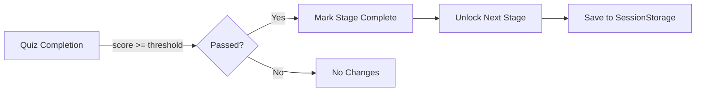

# Data Model: Stage Progression with Passing Score Requirement

**Feature**: 003-once-a-learning
**Date**: October 5, 2025
**Status**: Complete ✓

## Overview

This feature requires **NO new data structures**. All entities, types, and relationships already exist in the codebase. This document describes the existing data model and how it supports stage progression.

## Existing Entities

### Learner

**Purpose**: Represents a user's learning session and progress state

**Location**: `src/types/index.ts`

**Structure**:

```typescript
export interface Learner {
    sessionId: string
    stageStatuses: Record<StageId, StageStatus>  // ← Key for progression
    quizAttempts: QuizAttempt[]
    moduleCompletions: Record<ModuleId, boolean>
    preferences: {
        theme?: 'light' | 'dark'
    }
    sessionCounters: SessionCounters
}
```

**Relevant Fields for Progression**:

- `stageStatuses`: Maps each stage ID to its status ('locked', 'in-progress', or 'completed')
- `quizAttempts`: History of all quiz attempts (includes pass/fail status)

**State Transitions** (enhanced by this feature):

```
'locked' → 'in-progress' → 'completed'
    ↑           ↑              ↑
    |           |              |
Initial    User starts    Quiz passed ← NEW BEHAVIOR
state      stage          (automatic)
```

**Storage**: SessionStorage (via `StorageService.saveLearner()`)

---

### Stage

**Purpose**: Defines a learning stage in the curriculum

**Location**: `src/types/index.ts`

**Structure**:

```typescript
export interface Stage {
    id: StageId
    name: string
    description: string
    objectives: string[]
    estimatedMinutes: number
    sequenceOrder: number  // ← Key for finding next stage
    prerequisites: StageId[]
    modules: Module[]
    quiz: Quiz
    concepts: ConceptId[]
}
```

**Relevant Fields for Progression**:

- `sequenceOrder`: Numeric order (1-5) determining stage progression sequence
- `quiz`: Associated quiz that triggers progression when passed

**Stage Sequence** (from `src/content/stages.ts`):

1. Foundations (sequenceOrder: 1)
2. Architecture & Messages (sequenceOrder: 2)
3. Advanced Patterns (sequenceOrder: 3)
4. Building & Debugging (sequenceOrder: 4)
5. Mastery (sequenceOrder: 5)

**Storage**: Static content (embedded in ContentService)

---

### Quiz

**Purpose**: Assessment for a learning stage

**Location**: `src/types/index.ts`

**Structure**:

```typescript
export interface Quiz {
    id: string
    stageId: StageId  // ← Links quiz to stage
    title: string
    description: string
    passingThreshold: number  // ← Key for pass/fail determination (e.g., 0.7 = 70%)
    questions: QuizQuestion[]
    timeLimit?: number
}
```

**Relevant Fields for Progression**:

- `stageId`: Identifies which stage this quiz belongs to
- `passingThreshold`: Minimum score (0-1) required to pass (typically 0.7)

**Storage**: Static content (embedded in ContentService)

---

### QuizAttempt

**Purpose**: Records a learner's attempt at a quiz

**Location**: `src/types/index.ts`

**Structure**:

```typescript
export interface QuizAttempt {
    id: string
    quizId: string
    stageId: StageId
    timestamp: Date
    answers: QuizAnswer[]
    score: number         // ← Calculated score (0-1)
    passed: boolean       // ← Key for triggering progression
}
```

**Relevant Fields for Progression**:

- `passed`: Boolean indicating if score met passing threshold
- `stageId`: Identifies which stage to mark as complete

**Calculation Logic** (existing in QuizService):

```typescript
const score = correctAnswers / totalQuestions
const passed = score >= quiz.passingThreshold
```

**Storage**: Stored in `Learner.quizAttempts[]` array (SessionStorage)

---

## Type Definitions

### StageId

```typescript
export type StageId =
    | 'foundations'
    | 'architecture-messages'
    | 'advanced-patterns'
    | 'building-debugging'
    | 'mastery'
```

**Usage**: Unique identifier for stages

---

### StageStatus

```typescript
export type StageStatus = 'locked' | 'in-progress' | 'completed'
```

**Status Meanings**:

- `'locked'`: Stage not yet accessible (prerequisites not met)
- `'in-progress'`: Stage is active (user can access content and take quiz)
- `'completed'`: Stage quiz passed (stage finished)

**New Behavior** (this feature):

- When a quiz is passed, current stage becomes `'completed'`
- Next stage automatically becomes `'in-progress'` (unlocked)

---

## Data Relationships

### Stage Progression Flow



### Service Layer Dependencies

```
QuizService.completeQuizAttempt()
    ↓ reads
ContentService.getAllStages()  ← Get stage sequence
    ↓ calls (if passed)
LearnerService.completeStage(currentStageId, nextStageId)
    ↓ updates
Learner.stageStatuses
    ↓ persists
StorageService.saveLearner()
```

---

## Validation Rules

### Stage Status Transitions

**Valid Transitions**:

- `'locked'` → `'in-progress'` (when user starts stage or automatic unlock)
- `'in-progress'` → `'completed'` (when quiz passed)

**Invalid Transitions** (should never occur):

- `'completed'` → `'locked'` (progression is irreversible)
- `'completed'` → `'in-progress'` (already finished)
- `'locked'` → `'completed'` (must go through in-progress)

**Edge Case**: Setting an already-completed stage to `'completed'` again (idempotent, safe)

### Quiz Score Validation

**Requirements**:

- Score must be between 0 and 1 (inclusive)
- Passing threshold is per-quiz (typically 0.7)
- Passed status: `score >= passingThreshold`

**Example**:

```typescript
quiz.passingThreshold = 0.7  // 70% required
attempt.score = 0.75          // 75% achieved
attempt.passed = true         // ✓ Pass → trigger progression
```

### Sequence Order Validation

**Requirements**:

- Each stage must have unique `sequenceOrder` value
- Values must be continuous integers (1, 2, 3, 4, 5)
- No gaps in sequence

**Used For**:

- Sorting stages to find next stage
- Determining progression path

---

## State Mutations

### Mutation 1: Quiz Completion (Enhanced)

**Service**: `QuizService.completeQuizAttempt()`

**Before State**:

```typescript
learner.stageStatuses = {
    'foundations': 'in-progress',
    'architecture-messages': 'locked',
    // ...
}
```

**Action**: Complete Foundations quiz with 75% score (passing threshold 70%)

**After State** (NEW BEHAVIOR):

```typescript
learner.stageStatuses = {
    'foundations': 'completed',              // ← Changed
    'architecture-messages': 'in-progress',  // ← Changed (unlocked)
    // ...
}
```

### Mutation 2: Stage Completion (Bug Fix)

**Service**: `LearnerService.completeStage()`

**Bug Fix**: Change next stage status from `'locked'` to `'in-progress'`

**Before (BUG)**:

```typescript
if (nextStageId) {
    updatedStatuses[nextStageId] = 'locked'  // ← Wrong! Doesn't unlock
}
```

**After (FIXED)**:

```typescript
if (nextStageId) {
    updatedStatuses[nextStageId] = 'in-progress'  // ← Correct! Unlocks stage
}
```

---

## No Data Model Changes Required

**Summary**:

- ✅ All entities exist (`Learner`, `Stage`, `Quiz`, `QuizAttempt`)
- ✅ All types defined (`StageId`, `StageStatus`)
- ✅ All relationships established (Quiz → Stage → Learner)
- ✅ All storage mechanisms in place (SessionStorage via StorageService)

**Only Behavior Changes**:

1. `QuizService.completeQuizAttempt()` will call `LearnerService.completeStage()` when quiz passed
2. `LearnerService.completeStage()` will set next stage to `'in-progress'` instead of `'locked'`

---

## Performance Characteristics

### Storage Size

- No new fields added to `Learner` interface
- No increase in SessionStorage usage

### Computational Complexity

- Finding next stage: O(n log n) where n=5 (negligible)
- Updating stage status: O(1) object property access
- Total progression overhead: <1ms

---

## Migration & Compatibility

### Backward Compatibility

- ✅ Existing learner data remains valid
- ✅ No schema changes required
- ✅ No data migration needed

### Session Compatibility

- New sessions: Automatically benefit from progression
- Existing sessions: Next quiz pass will trigger progression
- No breaking changes to existing functionality

---

*Data model analysis complete. Ready for contract design and implementation.*
