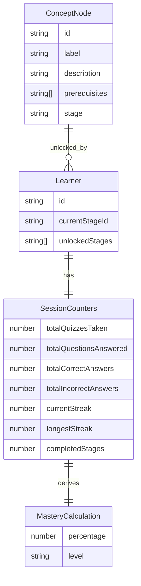
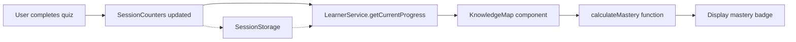
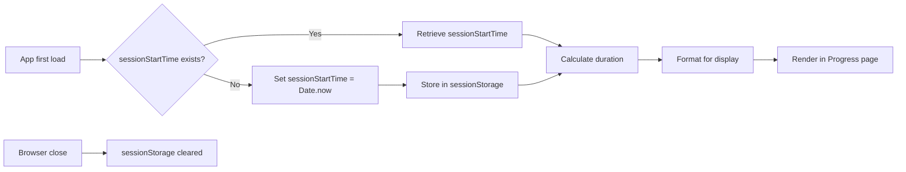

# Data Model: UI Fixes - Code Snippets, Knowledge Map Progress, and Time Tracking

**Feature**: 004-fix-code-snippet  
**Date**: October 5, 2025  
**Status**: No data model changes required

## Overview

This feature requires **NO changes to the existing data model**. All fixes are UI/calculation improvements that use existing type definitions.

## Existing Entities (No Modifications)

### 1. SessionCounters

**Location**: `src/types/index.ts`

**Purpose**: Tracks learner quiz performance metrics.

```typescript
interface SessionCounters {
  totalQuizzesTaken: number;
  totalQuestionsAnswered: number;
  totalCorrectAnswers: number;
  totalIncorrectAnswers: number;
  currentStreak: number;
  longestStreak: number;
  completedStages: number;
}
```

**Usage in Feature 004**:

- **FR-005**: Calculate mastery percentage from `totalCorrectAnswers / totalQuestionsAnswered`
- **No changes required**: All needed data already tracked

### 2. ConceptNode

**Location**: `src/types/index.ts`

**Purpose**: Represents a single concept in the knowledge map graph.

```typescript
interface ConceptNode {
  id: string;
  label: string;
  description?: string;
  prerequisites?: string[];
  stage?: string;
  // ... other properties
}
```

**Usage in Feature 004**:

- **FR-006**: Display mastery level per concept (calculated from SessionCounters)
- **FR-007**: Color-code concept nodes based on mastery level
- **No changes required**: Mastery is a derived value, not stored

### 3. Learner

**Location**: `src/types/index.ts`

**Purpose**: Represents the current learner's progress and state.

```typescript
interface Learner {
  id: string;
  currentStageId: string;
  unlockedStages: string[];
  // ... other properties
}
```

**Usage in Feature 004**:

- **No direct usage**: Feature focuses on counters and UI rendering
- **No changes required**

### 4. SessionStorage Schema

**Location**: `src/services/StorageService.ts` (implementation)

**Purpose**: Client-side persistence for session data.

**Keys Used**:

```typescript
{
  'learner': Learner,                    // Existing
  'sessionCounters': SessionCounters,    // Existing
  'sessionStartTime': string,            // NEW (timestamp as string)
}
```

**Changes Required**:

- **NEW KEY**: `sessionStartTime` (stores timestamp in milliseconds as string)
- **Type**: `string` (serialized `number`)
- **Usage**: FR-008, FR-009 (time tracking calculation)
- **Lifecycle**: Set on first app load, cleared on browser close
- **Implementation**: No type definition needed (primitive string storage)

## Entity Relationships



**Relationship Usage in Feature 004**:

1. **SessionCounters → Mastery Calculation** (NEW, derived):
   - Input: `totalCorrectAnswers`, `totalQuestionsAnswered`
   - Output: `mastery percentage` (0-100)
   - Formula: `(totalCorrectAnswers / totalQuestionsAnswered) * 100`
   - Classification: 0-40% = Beginner, 41-70% = Intermediate, 71-89% = Advanced, 90-100% = Master

2. **ConceptNode → Mastery Display** (NEW, UI only):
   - Each concept rendered with mastery badge
   - Color-coding based on mastery level
   - No data stored, purely presentational

3. **sessionStartTime → Session Duration** (NEW, derived):
   - Stored in sessionStorage as timestamp string
   - Calculated: `Date.now() - parseInt(sessionStartTime)`
   - Formatted for display: "1h 23m 45s"

## Data Flow Diagrams

### 1. Mastery Calculation Flow



**Steps**:

1. Quiz completion updates `SessionCounters` (existing flow)
2. `LearnerService.getCurrentProgress()` retrieves counters
3. `KnowledgeMap` component renders concepts
4. `calculateMastery()` computes percentage from counters
5. Badge component displays mastery level with color coding

**Performance**: O(1) calculation per concept, <1ms per concept

### 2. Time Tracking Flow



**Steps**:

1. On app initialization, check if `sessionStartTime` exists
2. If not, set to current timestamp and store
3. If exists, retrieve from sessionStorage
4. Calculate `duration = Date.now() - sessionStartTime`
5. Format duration (e.g., "1h 23m")
6. Display in Progress page header

**Performance**: O(1) sessionStorage read, <1ms calculation

## Data Validation Rules

### SessionCounters Validation (Existing)

**Invariants**:

- `totalQuestionsAnswered = totalCorrectAnswers + totalIncorrectAnswers` (always true)
- `totalCorrectAnswers >= 0`
- `totalQuestionsAnswered >= 0`
- `currentStreak >= 0`
- `longestStreak >= currentStreak`

**Mastery Calculation Edge Cases**:

- If `totalQuestionsAnswered === 0`: return `0%` (avoid division by zero)
- If `totalCorrectAnswers > totalQuestionsAnswered`: data corruption, cap at `100%`

### sessionStartTime Validation (New)

**Invariants**:

- Must be valid timestamp (parseable to number)
- Must be <= current time (no future timestamps)

**Error Handling**:

- If missing: default to `Date.now()` (duration = 0)
- If invalid (NaN): default to `Date.now()`
- If future timestamp: default to `Date.now()`

## Storage Size Impact

**Before Feature 004**:

```json
{
  "learner": { /* ~200 bytes */ },
  "sessionCounters": { /* ~100 bytes */ }
}
```

**Total**: ~300 bytes

**After Feature 004**:

```json
{
  "learner": { /* ~200 bytes */ },
  "sessionCounters": { /* ~100 bytes */ },
  "sessionStartTime": "1728123456789"  // ~15 bytes
}
```

**Total**: ~315 bytes

**Impact**: +15 bytes (~5% increase) ✅ Negligible

## Migration & Compatibility

**Migration**: None required (new feature, not a breaking change)

**Backward Compatibility**:

- Old sessions without `sessionStartTime`: default to `Date.now()` (duration = 0)
- Old sessions with `SessionCounters = 0`: mastery = 0% (correct behavior)
- No version bump needed (additive change only)

**Forward Compatibility**:

- Future features can use `sessionStartTime` for analytics
- Future features can extend mastery calculation with weighting
- No schema locks prevent evolution

## Summary

**Data Model Changes**: ZERO ✅

**New Storage Keys**: 1 (`sessionStartTime` in sessionStorage)

**New Derived Values**: 2 (`mastery percentage`, `session duration`)

**Type Definitions Required**: 0 (all use existing types)

**Breaking Changes**: 0

**Storage Impact**: +15 bytes (~5% increase)

This feature exemplifies **UI-focused improvements with minimal data layer impact**. All calculations are derived from existing data, ensuring no schema evolution complexity.
